<div align="center">

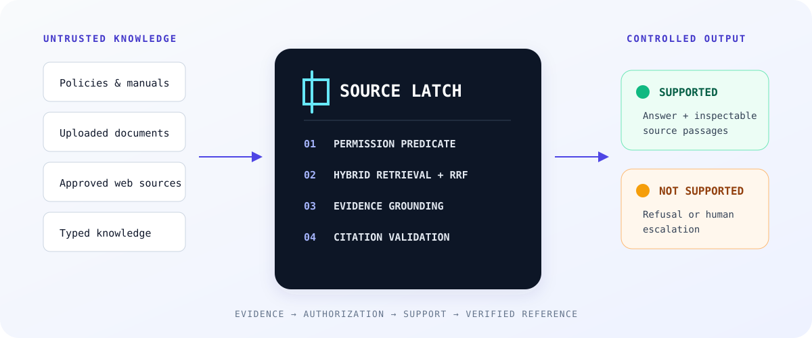

# SourceLatch

### Governed Enterprise Knowledge & Evidence Platform

SourceLatch turns approved organizational knowledge into permission-aware, inspectable answers. It combines hybrid retrieval with deterministic authorization, pre-generation evidence checks, citation validation, refusal, escalation, and operational records.

**Retrieval is not authorization. Generation is not evidence. A citation is not valid merely because a model printed one.**

[Live Demo](https://atlas-knowledge-ai.vercel.app) · [Architecture](#system-architecture) · [RAG Design](docs/RAG_DESIGN.md) · [Security](#security-model) · [Quickstart](#local-quickstart)


[](LICENSE)

</div>

<a href="https://atlas-knowledge-ai.vercel.app">
  
</a>

<p align="center"><sub><strong>Knowledge operations:</strong> quality, retrieval, feedback, and source usage computed from recorded activity—not placeholder metrics.</sub></p>

> [!NOTE]
> The hosted demo retains its original hostname and demo-account identifiers. The public product identity is **SourceLatch**; those legacy strings remain only where they are part of a working deployment contract.

## Contents

- [Why SourceLatch](#why-sourcelatch)
- [The 30-second mental model](#the-30-second-mental-model)
- [Trust model](#trust-model)
- [Core capabilities](#core-capabilities)
- [System architecture](#system-architecture)
- [Evidence and ingestion](#evidence-and-ingestion)
- [Governed retrieval](#governed-retrieval)
- [Access control](#access-control)
- [Grounding and citation integrity](#grounding-and-citation-integrity)
- [Security model](#security-model)
- [Knowledge operations](#knowledge-operations)
- [Provider and demo model](#provider-and-demo-model)
- [Product walkthrough](#product-walkthrough)
- [API and usage](#api-and-usage)
- [Technical specifications](#technical-specifications)
- [Testing and evaluation](#testing-and-evaluation)
- [Deployment](#deployment)
- [Local quickstart](#local-quickstart)
- [Design principles](#design-principles)
- [Documentation](#documentation)

## Why SourceLatch

Most RAG diagrams collapse a risky system into three boxes: embed, retrieve, generate. That omits the boundaries that determine whether an answer should exist at all.

| Failure mode | What went wrong | SourceLatch control |
|---|---|---|
| **Retrieval** | Relevant material was not found. | Semantic and lexical candidate sets are fused, reranked, and measured. |
| **Authorization** | Material became visible to a caller who could not read it. | Access level is part of the SQL retrieval predicate, then checked again in application logic. |
| **Grounding** | Retrieved text was related but insufficient to support the question. | Evidence confidence and coverage are evaluated before the governed generator is invoked. |
| **Citation** | A model emitted a convincing source marker that was never retrieved. | Citation ordinals are resolved against the exact prompt source set; invalid markers are stripped and recorded. |
| **Governance** | Nobody can reconstruct how an answer was produced. | Messages, citations, retrieval identifiers, grounding, feedback, escalations, audit events, and knowledge-gap signals become records. |

A conventional retrieval system asks, “What text resembles this question?” SourceLatch must also ask:

- Is this caller allowed to retrieve that text?
- Does the resulting evidence cover the question strongly enough to generate?
- Do the model's citation markers resolve to passages that actually crossed the retrieval boundary?
- If support is weak, should the system refuse or hand the case to a person?

The thesis is simple: **knowledge becomes usable through controlled transitions, not through proximity alone.**

## The 30-second mental model

1. A question enters with an authenticated role or the anonymous `PUBLIC` role.
2. The intent router chooses local conversation handling, general model knowledge, live external search, or governed organizational knowledge.
3. On the governed lane, the active workspace and permitted knowledge base are resolved server-side.
4. Vector and PostgreSQL full-text searches run over rows allowed by the caller's content level.
5. Reciprocal-rank fusion merges candidates whose native scores are not directly comparable.
6. A deterministic reranker scores coverage, first-stage rank, proximity, rarity, title match, and length.
7. Application logic rechecks every candidate against the access ladder.
8. Confidence and coverage produce `SUPPORTED`, `PARTIALLY_SUPPORTED`, or `UNSUPPORTED`.
9. `UNSUPPORTED` evidence short-circuits the governed generator.
10. Supported evidence is delimited as untrusted source text and sent to the configured generator.
11. Citation markers are validated against the exact retrieved source ordinals.
12. The answer, evidence links, route, retrieval identifiers, audit data, and any escalation are persisted.

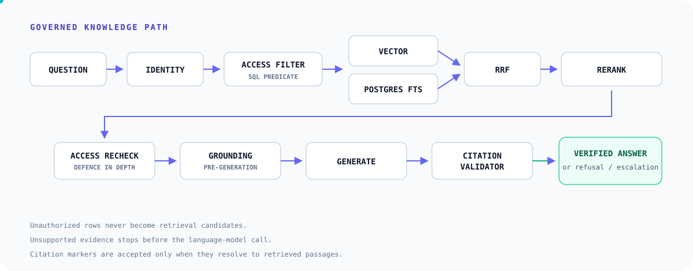

> [!IMPORTANT]
> The pre-generation grounding gate and citation guarantees in this README describe the **governed organizational-knowledge lane**. General-model and live-external routes are deliberately identified by a different `sourceType`; they do not masquerade as approved internal evidence.

## Trust model

SourceLatch treats user prompts, uploaded files, remote website content, retrieved passages, and model output as untrusted inputs. Deterministic application logic owns the security decisions.

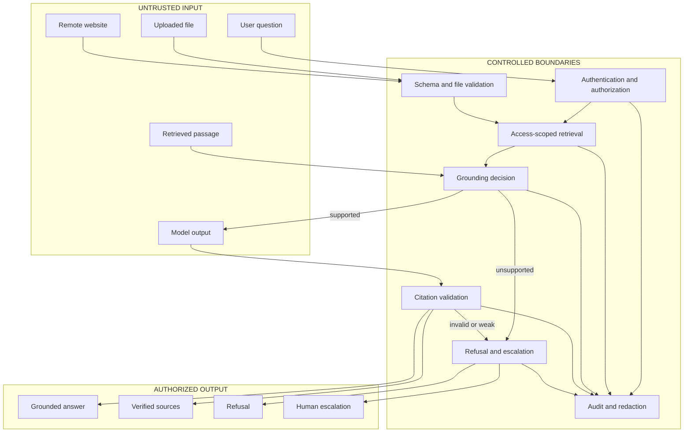

### Guarantees by construction

| Boundary | Enforced behavior |
|---|---|
| **No access decision delegated to the model** | The generator receives only passages returned through the caller's access predicate and defence-in-depth filter. Prompt content cannot widen the role. |
| **No unsupported governed generation** | Zero evidence or `UNSUPPORTED` grounding returns a controlled refusal with provider `none` and model `not-invoked`. |
| **No fabricated marker accepted as a citation** | Unknown source ordinals are stripped. Stored citations reference real `Document` and `DocumentChunk` rows. |
| **No forged source boundary trusted** | Control tokens inside source text are neutralized before prompt assembly. Retrieved text remains explicitly delimited as untrusted. |
| **No stale-session trust** | Session resolution maps missing, invalid, expired, revoked, suspended, or demo-disabled sessions to unauthenticated `PUBLIC`; demo role simulation is gated by `DEMO_MODE`. |

## Core capabilities

| System | Mechanism | Why it exists |
|---|---|---|
| **Knowledge ingestion** | PDF, DOCX, TXT, Markdown, CSV, website, FAQ, and manual-entry extraction with explicit processing states. | Index formation is observable and failed stages remain inspectable. |
| **Passage indexing** | Structure-aware chunks, embedding metadata, pgvector storage, and PostgreSQL full-text indexes. | Retrieval can preserve section/page provenance while combining semantic and exact-term recall. |
| **Governed retrieval** | Workspace/knowledge-base scope, SQL access predicate, vector + FTS retrieval, RRF, deterministic reranking, and access recheck. | Relevant text must also be authorized and operationally explainable. |
| **Evidence gate** | Confidence from top score, query coverage, result agreement, and score margin. | Relevance alone does not authorize generation. |
| **Citation integrity** | Marker parsing, ordinal validation, renumbering, invalid-marker diagnostics, and passage-backed citation rows. | Citation-shaped text is treated as model output until proven against retrieved evidence. |
| **Human review** | Explicit human requests, weak evidence, provider failures, injection risk, and negative feedback can create or reuse escalations. | Uncertainty is an operational state, not an invitation to improvise. |
| **Knowledge operations** | Analytics, feedback, knowledge gaps, conflict signals, evaluations, audit logs, and component health. | Quality and missing coverage become queryable work. |
| **Provider boundary** | Pluggable embedding and generation registries plus deterministic demo providers. | Governance remains stable while inference implementations change. |

## System architecture

SourceLatch is a Next.js application with server-owned authorization and retrieval decisions. PostgreSQL holds relational state, full-text indexes, and pgvector embeddings; local or Supabase-backed object storage holds source files.

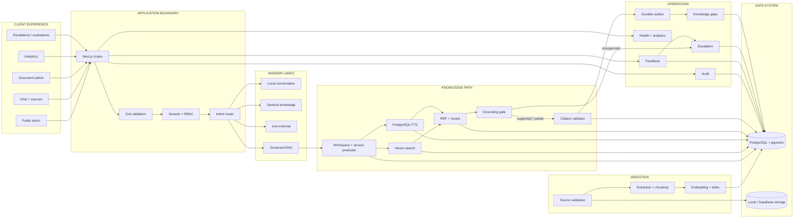

### User view versus knowledge-engine view

| User view | SourceLatch view |
|---|---|
| Question → answer → sources | Identity → workspace → route → access class → vector candidates + lexical candidates → RRF → rerank → access recheck → confidence → grounding verdict → generator → citation validation → persistence → escalation signal |

The compact interface is intentional. Complexity remains visible to operators without being pushed into every application interaction.

## Evidence and ingestion

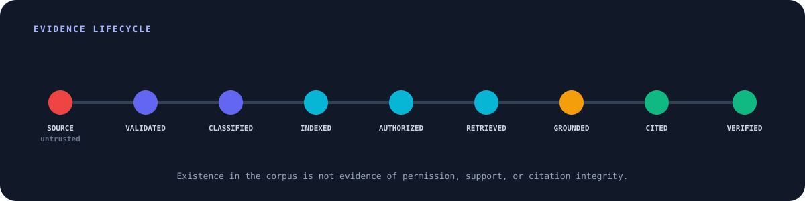

Content does not become trusted because it exists in the database. A source becomes useful only after it is validated, classified, indexed, authorized for the current caller, retrieved, grounded, and cited.

### Ingestion state machine

The persisted document states are the execution vocabulary—not decorative progress labels.

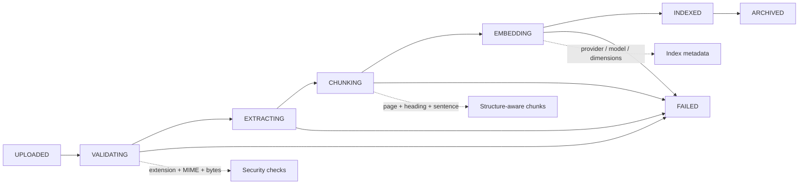

Before extraction, uploads are checked for size, safe filename, supported extension, declared MIME agreement, and file signature for PDF/DOCX. Text formats reject binary-looking content. Byte-identical duplicates are rejected by checksum before processing. Website ingestion validates the URL before each request and redirect.

The indexed formats are:

| Source | Extraction path | Provenance retained |
|---|---|---|
| PDF | `unpdf` text extraction | Page number |
| DOCX | `mammoth` conversion | Heading structure where available |
| TXT / Markdown | Text normalization | Section headings |
| CSV | Quoted-field-aware row parsing | Table/row structure |
| Website | Single approved URL, HTML content extraction | Source URL |
| FAQ / manual entry | Typed content | Supplied title and section structure |

Chunking treats page boundaries as hard boundaries, carries section paths, keeps sentence boundaries when possible, and records the configured embedding provider, model, and vector width on each chunk.

## Governed retrieval

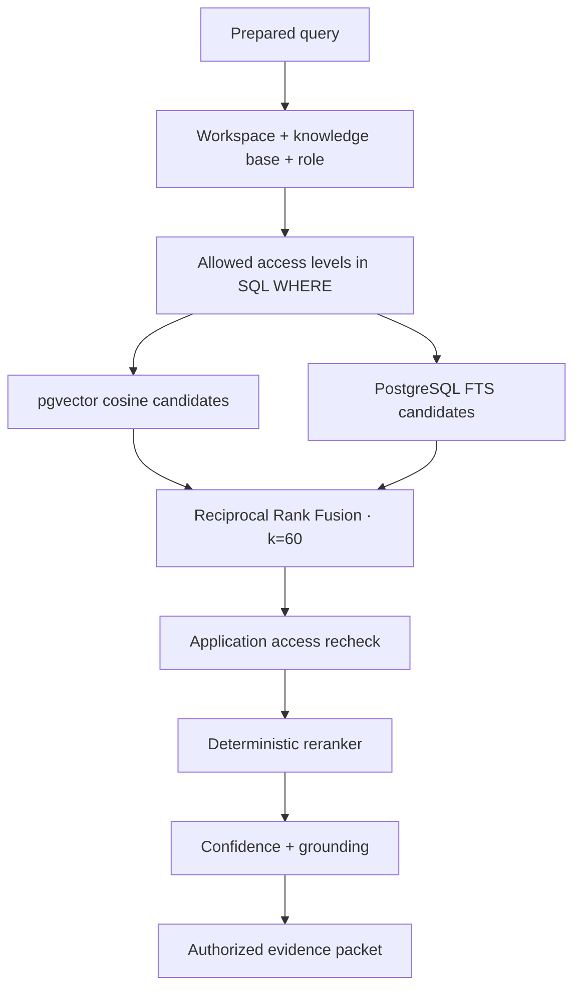

### Hybrid search without score fiction

Vector similarity and text-search rank measure different things. SourceLatch does not add their raw scores. It converts each result list to ordinal evidence and combines ranks using reciprocal-rank fusion:

```text
RRF(document) = Σ 1 / (60 + rank_in_result_list)
```

- **Vector search** captures semantic proximity through pgvector cosine distance (`<=>`).
- **Full-text search** captures exact language, identifiers, policy names, and rare terms through `tsvector`, `websearch_to_tsquery`, `ts_rank`, and a GIN index.
- **RRF** rewards candidates found by both systems without claiming the score spaces are comparable.
- **Fallback behavior** keeps retrieval available through lexical/database fallback paths when the vector extension or operator is unavailable; the runtime records whether the query was hybrid.

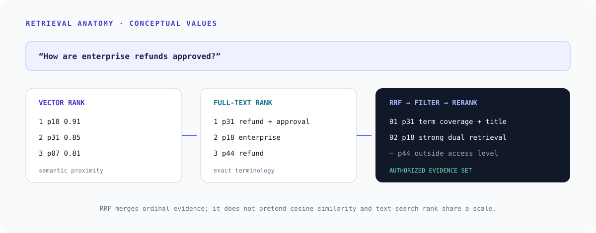

### Deterministic reranking

The reranker is lexical and synchronous—not a neural cross-encoder. That makes its inputs and ordering straightforward to test.

| Signal | Weight | Purpose |
|---|---:|---|
| Query-term coverage | 42% | Rewards passages that address more of the substantive question. |
| First-stage score | 20% | Preserves evidence from retrieval rank. |
| Term proximity | 16% | Rewards query terms occurring near one another. |
| Term rarity | 12% | Gives discriminating terms more influence than common corpus terms. |
| Title / heading match | 10% | Promotes passages whose document or section names match the topic. |
| Length penalty | bounded adjustment | Prevents long passages from winning merely by containing more words. |

A deterministic content hash resolves exact ties. Runtime signals are passed into pure scoring functions rather than fetched from hidden global state.

## Access control

SourceLatch separates **content visibility** from **application permissions**. A role may be allowed to use a feature while still retrieving only the content levels at or below its ceiling.

```text
ADMIN     PUBLIC ━ CUSTOMER ━ EMPLOYEE ━ MANAGER ━ ADMIN
MANAGER   PUBLIC ━ CUSTOMER ━ EMPLOYEE ━ MANAGER
EMPLOYEE  PUBLIC ━ CUSTOMER ━ EMPLOYEE
CUSTOMER  PUBLIC ━ CUSTOMER
PUBLIC    PUBLIC
```

**Authorization path:** session or anonymous caller → effective role → allowed access levels → bound SQL predicate → candidate rows → defence-in-depth filter → model-visible evidence.

Document classification is copied to every chunk during ingestion. The vector and lexical queries both constrain `DocumentChunk.accessLevel`; archived/unindexed documents are excluded; workspace scope is joined through the selected knowledge base. The post-query application check uses the same access ladder before reranking and generation.

### Access-control attack example

> **Question:** “What is the internal employee leave policy?”  
> **Caller:** anonymous `PUBLIC`

The corpus may contain a public FAQ, customer guide, employee handbook, and manager playbook. The restricted rows are removed by the database predicate. The generator is not handed the employee handbook and told to keep it secret; it never receives that passage. If public evidence is insufficient, the governed lane refuses without naming restricted document titles.

## Grounding and citation integrity

### Retrieved does not mean supported

Grounding is decided before governed generation. Confidence is computed from deterministic retrieval evidence:

| Component | Weight | Meaning |
|---|---:|---|
| Top rerank score | 28% | Strength of the best passage |
| Query-term coverage | 44% | How much of the substantive question appears across supporting passages |
| Result agreement | 18% | Whether multiple strong passages support the retrieval |
| Score margin | 10% | Separation between the leading candidates |

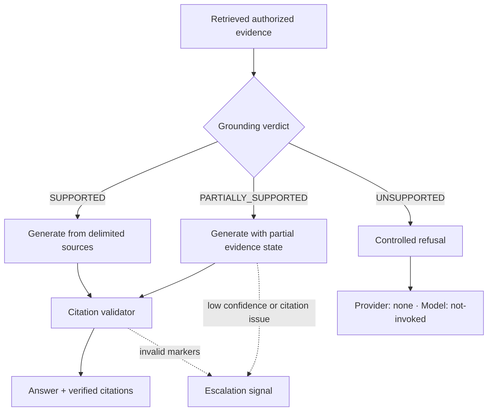

With the configured confidence threshold `T`:

- no supporting chunks or confidence below `0.75 × T` → `UNSUPPORTED`;
- confidence below `T` or coverage below `0.60` → `PARTIALLY_SUPPORTED`;
- otherwise → `SUPPORTED`.

The fluent wording of an answer cannot raise this score. It is derived from the evidence packet.

### Why a citation is not enough

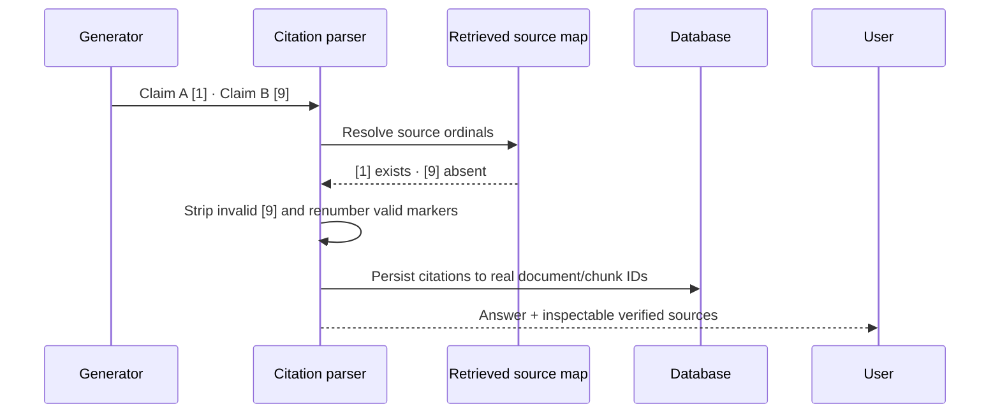

Valid citations retain the real document, section, page (when extracted), excerpt, and relevance score. If a non-refusal answer contains no valid marker, SourceLatch may attach the strongest retrieved passages as fallback evidence; it never converts an unknown marker into a source.

### Prompt-injection boundary

The injection detector recognizes instruction override, system-prompt extraction, secret extraction, access bypass, tool/network requests, exfiltration, false-verification, and role-impersonation patterns after Unicode/control-character normalization. Detection is a risk signal—not the authorization mechanism.

On the governed lane:

- access is decided before prompt assembly;
- source text is wrapped in explicit untrusted-source delimiters;
- forged delimiters are neutralized;
- the evidence generator receives no tools, database handle, provider credentials, or permission-changing capability;
- medium/high injection risk is audited and can raise a high-priority escalation.

The live-external route is a separate, explicit lane and may use the configured Gemini search capability. Its output is labeled external, not approved organizational evidence.

## Security model

Security decisions stay in deterministic server code. No model is asked to enforce tenancy, roles, source visibility, upload policy, SSRF rules, session validity, or citation membership.

| Surface | Threat | Implemented control |
|---|---|---|
| Passwords | Offline disclosure / weak passwords | `scrypt` with `N=32768`, `r=8`, `p=1`, a random 16-byte salt, 64-byte key, and a 12-character policy. |
| Sessions | Token disclosure / stale privilege | Opaque random token in an `HttpOnly`, `SameSite=Lax` cookie; SHA-256 token hash in PostgreSQL; 8-hour sliding expiry; revocation and active-user checks. |
| Login | Enumeration / brute force | Equal public failure message and password work; database-backed lockout after 8 failures in 15 minutes. Failed attempts store keyed IP hashes rather than emails. |
| Browser mutations | Cross-site requests | Double-submit CSRF token plus origin validation in the request guard. |
| Authorization | Role or tenant bypass | Server-side RBAC, workspace-resolved knowledge base selection, SQL access filtering, and an application recheck. |
| Uploads | Polyglots / traversal / oversized input | Basename sanitization, root containment, size limits, extension + MIME agreement, PDF/DOCX magic bytes, and binary-text rejection. |
| Website ingestion | SSRF / redirect escape | HTTP(S)-only URLs, allowed ports, DNS resolution, private/reserved IPv4 and IPv6 blocking, redirect revalidation, time/byte caps, and at most 3 redirects. |
| Retrieved text | Prompt injection | Detection, delimiter neutralization, no governed-lane tools, and authorization outside the prompt. |
| Model output | Fabricated citation | Marker validation against retrieved ordinals before citation persistence. |
| Logs and audit | Secret / IP disclosure | Structured logging with key/value redaction; audit metadata redaction; keyed IP hashing. |
| Health endpoint | Operational reconnaissance | Public liveness is minimal; component/provider details require `health:read`. |

> [!CAUTION]
> These are implemented controls and scoped invariants, not a claim of certification or immunity from attack. See the [threat model](docs/THREAT_MODEL.md) and [production hardening guide](docs/PRODUCTION_HARDENING.md) for the adversarial analysis and operating assumptions.

## Knowledge operations

SourceLatch treats uncertain answers as work that can be measured and reviewed.

**Operational loop:** questions → answers or refusals → feedback and evidence signals → escalations / knowledge gaps → human and content operations.

The synchronous chat path stores the conversation, answer, citations, retrieval identifiers, audit record, and escalation state. A durable `OutboxEvent` then moves non-critical follow-up work—identity resolution, customer-intelligence extraction, automation evaluation, and knowledge-gap tracking—off the response path. Workers claim rows with `FOR UPDATE SKIP LOCKED`, recover stale claims, and apply bounded exponential retry before a terminal failure state.

### Escalation signals

An escalation can be created or reused when:

- the governed route has no authorized knowledge base;
- evidence is unsupported or below the confidence threshold;
- a provider fails to return a usable governed answer;
- the model emits invalid citation markers;
- the caller explicitly requests a person;
- medium/high prompt-injection risk is detected;
- an answer receives `NOT_HELPFUL` feedback.

Knowledge gaps are tracked asynchronously when answers are unsupported or already carry an escalation signal. Repeated case-insensitive questions increment the existing open gap instead of creating unlimited duplicates. Material conflict detection separately looks for incompatible numeric or explicit policy claims across different retrieved documents with comparable scope.

### Recorded analytics

The analytics surface computes its values from stored deployment activity:

| Quality | Retrieval | Knowledge | Operations |
|---|---|---|---|
| Mean confidence | Average and p95 retrieval latency | Most-cited documents | Helpful / partial / not-helpful feedback |
| Supported / partial / unsupported rate | Question volume | Normalized common questions | Escalations and review state |
| Answers with citations | Recent retrieval count | Low-confidence topics | Component health |

Metrics describe this corpus and deployment. They are not general RAG-accuracy or latency benchmarks.

## Data architecture

The current Prisma schema contains **41 models and 34 enums**. The diagram below deliberately shows the knowledge/evidence spine rather than letting adjacent CRM entities dominate the public architecture.

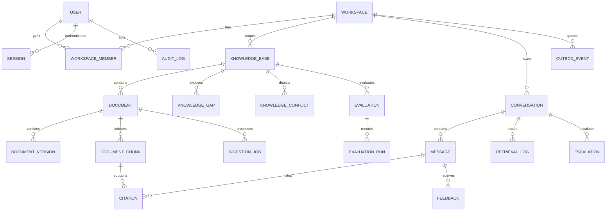

PostgreSQL is used for four different jobs in one transactional system: relational metadata and identity, authorization predicates, full-text retrieval, and vector similarity. The schema separates `Document` lifecycle from immutable-ish versions and indexed chunks; conversations from messages; model output from citation relations; and synchronous request records from asynchronous outbox work.

## Provider and demo model

Provider choice changes inference, not the governed pipeline around it.

| Provider | Embeddings | Generation | Notes |
|---|:---:|:---:|---|
| Deterministic demo | ✓ | ✓ | Lexical hashing/normalization for vectors; extractive source-sentence generation. |
| OpenAI | ✓ | ✓ | Native embedding dimension request; chat-completions adapter. |
| Google / Gemini | ✓ | ✓ | Google embedding adapter; Gemini generation and explicit live-search lane. |
| Anthropic | — | ✓ | Messages API adapter. |
| OpenRouter | — | ✓ | OpenAI-shaped generation adapter. |
| Hugging Face | ✓ | — | Feature-extraction embedding adapter. |
| Ollama | ✓ | ✓ | Local embedding and generation endpoints. |

Remote embedding and generation adapters use bounded timeouts, response-shape checks, classified errors, and retries limited to transient failures. Provider/model/dimension metadata is recorded with embedded chunks so index drift is detectable.

### Reproducible demo mode

No paid model credential is required to exercise the knowledge pipeline.

| Demo mode | Live mode |
|---|---|
| Question → deterministic embedder → governed retrieval → extractive generator → citation validator | Question → configured embedder → governed retrieval → configured LLM → citation validator |

Both paths cross the same authorization, fusion, grounding, citation, audit, and escalation boundaries.

The demo embedder is repeatable and credential-free; it does not pretend to understand every semantic synonym. The extractive generator copies relevant sentences from retrieved sources and adds source ordinals instead of paraphrasing. That makes demos and regression tests predictable while preserving the same access, fusion, grounding, citation, audit, and escalation code paths used by live providers.

## Product walkthrough

<table>
  <tr>
    <td width="50%"></td>
    <td width="50%"></td>
  </tr>
  <tr>
    <td><strong>Grounded response</strong> — answer text remains attached to inspectable citation records.</td>
    <td><strong>Evidence drawer</strong> — users can inspect the document, section/page provenance, excerpt, and relevance instead of treating a citation as decoration.</td>
  </tr>
  <tr>
    <td></td>
    <td></td>
  </tr>
  <tr>
    <td><strong>Access-aware refusal</strong> — restricted evidence is not revealed to a lower-access caller, including through document-title leakage.</td>
    <td><strong>Document control</strong> — lifecycle state, source type, classification, and ingestion outcomes remain operationally visible.</td>
  </tr>
  <tr>
    <td></td>
    <td></td>
  </tr>
  <tr>
    <td><strong>Human escalation</strong> — weak evidence, risk signals, explicit requests, and negative feedback become reviewable cases.</td>
    <td><strong>Component health</strong> — privileged operators can inspect database, storage, embedding, generation, and indexing readiness without exposing those details publicly.</td>
  </tr>
</table>

## API and usage

The product is UI-first, but its chat surface is a real JSON route. Anonymous requests are allowed as `PUBLIC`; authenticated requests inherit their server-side session role. Browser mutations go through origin/CSRF and rate-limit guards, so this is an application route rather than a bearer-token public SDK contract.

```ts
const response = await fetch('/api/chat', {
  method: 'POST',
  headers: {
    'Content-Type': 'application/json',
    'x-atlas-csrf': csrfToken,
  },
  body: JSON.stringify({
    question: 'How are enterprise refunds approved?',
    conversationId: null,
    knowledgeBaseId: null,
  }),
});

const result = await response.json();
```

Condensed governed-lane response shape:

```json
{
  "ok": true,
  "conversationId": "cm...",
  "messageId": "cm...",
  "answer": "... [1]",
  "grounding": "SUPPORTED",
  "confidence": 0.78,
  "route": "ORGANIZATIONAL_KNOWLEDGE",
  "sourceType": "APPROVED_KNOWLEDGE",
  "citations": [
    {
      "ordinal": 1,
      "documentId": "cm...",
      "documentTitle": "Enterprise Refund Policy",
      "sectionTitle": "Approvals",
      "pageNumber": 3,
      "excerpt": "...",
      "relevanceScore": 0.86
    }
  ],
  "provider": "demo",
  "model": "atlas-extractive-demo-v1",
  "traceId": "...",
  "pipelineMeta": {
    "accessLevels": ["PUBLIC", "CUSTOMER", "EMPLOYEE"],
    "retrieval": {
      "vectorCandidates": 10,
      "keywordCandidates": 7,
      "fusedCandidates": 12,
      "afterAccessFilter": 8,
      "rerankedCount": 5,
      "hybrid": true,
      "droppedByPostFilter": 0,
      "latencyMs": 19
    },
    "grounding": "SUPPORTED",
    "traceId": "...",
    "injectionFlagged": false,
    "escalationId": null
  }
}
```

The identifiers and numbers above are illustrative placeholders; the property names and enum values match the route contract.

## Technical specifications

<details open>
<summary><strong>Retrieval, grounding, and access</strong></summary>

| Subsystem | Specification |
|---|---|
| Vector engine | PostgreSQL `vector`; cosine distance with `<=>`; HNSW index from migrations |
| Lexical engine | English `tsvector` + `websearch_to_tsquery` / OR-term fallback; GIN index |
| Fusion | Reciprocal-rank fusion, `k = 60` |
| Reranking | Deterministic lexical scoring: coverage, first-stage rank, proximity, rarity, title match, length adjustment |
| Retrieval scope | Workspace (through knowledge base), selected knowledge base/document, indexed/non-archived state, allowed access levels |
| Access recheck | After candidate fusion and before reranking/generation |
| Query history | Follow-up rewriting uses user conversation turns; assistant text is excluded from query expansion |
| Confidence | Top score 28%, coverage 44%, agreement 18%, margin 10% |
| Grounding | `SUPPORTED`, `PARTIALLY_SUPPORTED`, `UNSUPPORTED` |
| Unsupported behavior | Controlled refusal; governed LLM not invoked; zero citations |
| Citation protocol | One-based `[n]` markers tied to the exact prompt source list; invalid ordinals stripped and recorded |
| Content roles | `PUBLIC`, `CUSTOMER`, `EMPLOYEE`, `MANAGER`, `ADMIN` with monotonic visibility |

</details>

<details>
<summary><strong>Ingestion and data</strong></summary>

| Subsystem | Specification |
|---|---|
| Inputs | PDF, DOCX, TXT, Markdown, CSV, website, FAQ, manual entry |
| Upload checks | Size; sanitized filename; extension/MIME agreement; PDF/DOCX magic bytes; text/binary check |
| Extraction | `unpdf`, `mammoth`, typed text/CSV/HTML paths |
| Chunking | Default 800 characters, 120-character whole-sentence overlap; page hard boundaries |
| Embedding batch | 64 texts per provider call |
| Vector width | Configurable 64–4096; default 768; provider output fitted to fixed index width |
| Processing states | `UPLOADED → VALIDATING → EXTRACTING → CHUNKING → EMBEDDING → INDEXED`, plus `FAILED` and `ARCHIVED` |
| Duplicate control | SHA-256 checksum before extraction/index work |
| Database | PostgreSQL 16 image for local/CI, Prisma 6, pgvector |
| Schema | 41 Prisma models, 34 enums |
| Object storage | Local filesystem or Supabase Storage |

</details>

<details>
<summary><strong>Security and operations</strong></summary>

| Subsystem | Specification |
|---|---|
| Password hashing | `scrypt` N=32768, r=8, p=1; 16-byte salt; 64-byte derived key |
| Session storage | Opaque token client-side; SHA-256 token hash in PostgreSQL; 8-hour sliding TTL |
| Browser request controls | Origin validation, double-submit CSRF, rate-limit profiles |
| SSRF | Scheme/port/hostname/IP/DNS checks; redirect revalidation; 3 redirects; timeout and byte cap |
| Injection handling | Eight pattern categories, Unicode/control normalization, risk score, delimiter neutralization, audit/escalation signal |
| Audit | Redacted previous/new data; keyed IP hashes; entity/action metadata |
| Public health | Liveness only |
| Privileged health | Component status for database, storage, embeddings, LLM, and document index |
| Async work | PostgreSQL outbox, atomic claiming, stale-claim recovery, exponential retry, minute Vercel cron |
| Retention settings | Independent configurable day windows for conversations, messages, retrieval logs, audit, feedback, and escalations |

</details>

<details>
<summary><strong>Platform</strong></summary>

| Layer | Technology |
|---|---|
| Application | Next.js 15 App Router, React 19 |
| Language | TypeScript 5.7 in strict mode |
| Validation | Zod |
| Database / ORM | PostgreSQL 16 + pgvector, Prisma 6 |
| Styling | Tailwind CSS 3.4 |
| Unit / integration | Vitest 3, four projects |
| Browser | Playwright 1.50, Chromium production-build runs |
| Local infrastructure | Docker Compose on host port 5434 |
| Hosted reference | Vercel application, Supabase PostgreSQL/pgvector and object storage |

</details>

## Testing and evaluation

The suite is organized around invariants rather than component snapshots.

| Project | Current audited definitions | What it exercises |
|---|---:|---|
| Unit | 181 | Chunking, extraction, embeddings, vector math, fusion, reranking, confidence, prompt/citation handling, RBAC, URL/file security, passwords, redaction, rate limits, environment rules, router, conflict detection, auth invariants, outbox behavior |
| Integration | 19 | Real PostgreSQL ingestion and chat persistence, citations, retrieval logs, escalations, feedback, audit, conversation ownership |
| Retrieval | 15 | Controlled corpus cases for exact/paraphrase/follow-up/multi-document/unsupported/restricted/injection/ambiguous/pricing/refund behavior, plus determinism and role reach |
| Security | 31 | Role ceilings, SQL filtering, title/source leakage, injection cases, login behavior, SSRF, audit secrecy |
| Playwright E2E | 45 | Public/authenticated journeys, role boundaries, ingestion, chat, evidence drawer, feedback/escalation, analytics, health, settings, responsive layout, demo money-path regression |

That is **246 Vitest cases across four projects plus 45 Playwright cases** in the current audited test inventory. This README does not label them “passing” without a current execution log; CI runs the projects against `pgvector/pgvector:pg16`.

### What the suite proves

- unauthorized chunks and restricted titles do not enter lower-role retrieval, answers, citations, or related sources;
- an invalid/expired/revoked session cannot inherit a demo role cookie;
- unsupported governed questions return zero citations and do not invoke the generator;
- citation rows point to genuinely retrieved chunks and fabricated markers are rejected;
- duplicate ingestion is stopped before work and failed processing states are persisted;
- prompt-injection attempts cannot grant access or produce secret/system-prompt disclosure;
- private/reserved URL targets are rejected before a document is created;
- conversation ownership, feedback rules, escalation persistence, and audit redaction are enforced;
- router selection, material-conflict scoping, and outbox claim/retry behavior are deterministic under test.

The retrieval suite is a **controlled regression evaluation** over the seeded demo corpus. It is designed to catch behavioral drift; it is not an industry benchmark or a general accuracy claim.

```bash
npm run test            # four Vitest projects
npm run test:e2e        # Playwright against a production build
npm run verify          # format, lint, typecheck, tests, dependency audit, build
```

## Deployment

```mermaid
flowchart LR
  DEV[Developer] --> GH[GitHub]
  GH --> CI[GitHub Actions]
  CI --> CIPG[(pgvector/pgvector:pg16)]
  CI --> V[Format · lint · typecheck · tests · audit · build]
  GH --> VE[Vercel]
  VE --> APP[Next.js application]
  APP --> SPG[(Supabase PostgreSQL + pgvector)]
  APP --> SSO[(Supabase Storage)]
  CRON[Vercel cron · every minute] --> TASK[/api/tasks]
  TASK --> OUT[(PostgreSQL outbox)]
```

The repository supports local Docker/PostgreSQL and the documented Vercel + Supabase reference deployment. `DATABASE_URL` serves application traffic; `DIRECT_URL` is available for migration/admin connections. The tasks route is protected by an internal secret and processes durable outbox events on the configured cron.

## Repository structure

```text
SourceLatch/
├── app/                         # App Router pages and JSON routes
│   ├── api/chat/                # guarded chat contract
│   └── dashboard/               # knowledge, analytics, review, settings
├── components/                  # product and evidence UI
├── lib/
│   ├── ai/                      # providers, prompts, answer and citation boundary
│   ├── auth/                    # sessions, password policy, guards, RBAC
│   ├── database/                # Prisma client and vector/FTS queries
│   ├── documents/               # extraction, chunking, ingestion state machine
│   ├── embeddings/              # deterministic and remote embedding adapters
│   ├── retrieval/               # query preparation, search, confidence, settings
│   ├── reranking/               # RRF and deterministic scoring
│   ├── security/                # upload, URL, injection, hashing, audit controls
│   ├── observability/           # structured logs and component health
│   └── outbox/                  # durable post-response processing
├── prisma/                      # 41-model relational/vector schema + migrations
├── tests/                       # unit, integration, retrieval, security, E2E
├── docs/                        # architecture, threat, data, deployment, design
└── docs/readme-assets/          # README-only technical artwork
```

## Local quickstart

Prerequisites: Node.js **24+**, Docker, and npm.

```bash
git clone https://github.com/arslanvuzmal/SourceLatch.git
cd SourceLatch
npm install
cp .env.example .env
npm run db:up
npm run db:migrate
npm run db:seed
npm run dev
```

Open [http://localhost:3000](http://localhost:3000). Local PostgreSQL listens on host port `5434`; the Docker image includes pgvector.

<details>
<summary><strong>Provider configuration</strong></summary>

Demo mode is the default. For live inference, select one embedding provider and one generation provider in `.env`:

```dotenv
EMBEDDING_PROVIDER=demo
LLM_PROVIDER=demo
EMBEDDING_DIMENSIONS=768
```

Supported embedding values are `demo`, `openai`, `google`, `huggingface`, and `ollama`. Supported generation values are `demo`, `openai`, `anthropic`, `gemini`, `openrouter`, and `ollama`. Environment parsing rejects a selected live provider when its credential/base URL is absent.

For all variables and deployment-specific storage settings, use [`.env.example`](.env.example) as the source of truth.

</details>

### Live demo

**[Open SourceLatch — Live Demo](https://atlas-knowledge-ai.vercel.app)**

The public deployment uses deterministic demo providers so governed retrieval, refusal, citation, access, and escalation behavior can be reproduced without sending approved document content to a paid model service.

| Role | Demo email | Password |
|---|---|---|
| Administrator | `admin@atlasknowledge.demo` | `AtlasDemo!2026` |
| Manager | `manager@atlasknowledge.demo` | `AtlasDemo!2026` |
| Employee | `employee@atlasknowledge.demo` | `AtlasDemo!2026` |
| Customer | `customer@atlasknowledge.demo` | `AtlasDemo!2026` |
| Public viewer | `viewer@atlasknowledge.demo` | `AtlasDemo!2026` |

These accounts authenticate only while `DEMO_MODE=true`. The visible legacy account and hostname strings are retained because they are current deployment identifiers—not product branding.

## Design principles

1. **Authorization precedes generation.** A model should never be asked to conceal evidence it should not have received.
2. **Retrieval is not proof.** Relevant passages are evaluated for evidence coverage before the governed generator runs.
3. **Model output is untrusted.** Citation-shaped text becomes a citation only after it resolves against retrieved sources.
4. **Unsupported evidence produces refusal, not improvisation.** The governed provider is explicitly not invoked.
5. **Semantic and lexical evidence are complementary.** RRF combines rankings without collapsing unlike scores into false precision.
6. **Security boundaries belong in deterministic code.** Sessions, roles, tenant scope, SSRF, upload policy, grounding, and citation membership do not depend on model compliance.
7. **Human escalation is a valid outcome.** Uncertainty becomes a reviewable record instead of a hidden failure.
8. **Operational events should be queryable.** Feedback, citations, gaps, conflicts, audits, evaluations, and outbox state live in the data model.
9. **Demo and live inference share governance.** Provider adapters change generation and embeddings; the permission, retrieval, grounding, citation, and audit boundaries remain.
10. **Content visibility and action permission are separate authorities.** A role's feature access does not silently expand the evidence it may retrieve.

## Documentation

| Document | What it explains |
|---|---|
| [Architecture](docs/ARCHITECTURE.md) | Original system topology, request paths, and module boundaries |
| [RAG design](docs/RAG_DESIGN.md) | Retrieval, fusion, reranking, confidence, grounding, and citations |
| [Database design](docs/DATABASE_DESIGN.md) | Relational/vector persistence decisions and indexing |
| [Engineering decisions](docs/DECISIONS.md) | Framework, language, validation, cryptography, and data-shape choices |
| [Threat model](docs/THREAT_MODEL.md) | Assets, adversaries, trust boundaries, controls, and residual risk |
| [Production hardening](docs/PRODUCTION_HARDENING.md) | Deployment checks and security operating guidance |
| [Test plan](docs/TEST_PLAN.md) | Test philosophy, projects, controlled evaluation, and historical baseline |
| [Deployment](docs/DEPLOYMENT_PLAN.md) | Vercel/Supabase setup and operational verification |
| [Design system](docs/DESIGN_SYSTEM.md) | UI tokens, responsive behavior, accessibility, and component conventions |
| [Security policy](SECURITY.md) | Vulnerability reporting and supported security process |

> [!NOTE]
> Some deeper documents retain historical architecture snapshots. Where they differ, current source, Prisma schema, migrations, and tests are authoritative; this README was audited against the current `main` branch.

## License and author

Released under the [MIT License](LICENSE).

Built by [Arslan Vuzmal](https://github.com/arslanvuzmal) as a working reference for permission-aware retrieval, evidence gating, citation integrity, and human-centered knowledge operations.
